# CS:GO Skin Economy Research Assistant

An intelligent research assistant built with LangChain that helps gather and structure information on the Counter Strike skin economy and marketplace, using both a local database of third-party marketplace data and online sources.

## Features

- Interactive research assistant focused on CS:GO skin prices and marketplace data
- Local database for skin prices from popular third-party marketplaces:

  - SkinPort
  - DMarket
  - CSFloat
  - Buff163
  - HaloSkins

- Web search capabilities for supplementary information
- Structured output using Pydantic models
- Multiple tool integration (CS:GO Skins Database, Search, Wikipedia, Save)
- Clean and maintainable code structure
- FastAPI integration for connecting with the frontend
- Advanced search capabilities:
  - Embedding-based semantic search for natural language queries
  - Fuzzy matching for handling typos and minor spelling errors
  - Hybrid search combining both approaches for optimal results

## Vector Embeddings for Semantic Search

### What Are Vector Embeddings?

Vector embeddings are numerical representations of text in a high-dimensional space where semantic similarity is captured by vector distance. In simpler terms, they transform words and phrases into lists of numbers (vectors) such that expressions with similar meanings have similar vectors.

For example, the embeddings for "AWP Dragon Lore" and "Dragon Lore AWP" would be close to each other in the vector space because they have very similar meanings, even though the word order is different. This allows our system to understand that a user asking about "Hedge Maze gloves" is likely interested in "Sport Gloves | Hedge Maze".

Using this methodoloy, we can then give a more accurate response to our user based on our parsed JSON data. 

### How Vector Embeddings Work in Our System

Our system uses vector embeddings in the following process:

```mermaid
graph TD
    A[Skin Database] --> B[Vector Encoding]
    B --> C[FAISS Index]
    
    D[User Query] --> E[Vector Encoding]
    E --> F[Vector Similarity Search]
    
    C --> F
    F --> G[Ranked Results]
    
    H[Fuzzy Matching] <--> I[Hybrid Results]
    G --> I
    
    style A fill:#36454F,stroke:#333,stroke-width:2px
    style D fill:#36454F,stroke:#333,stroke-width:2px
    style C fill:#36454F,stroke:#333,stroke-width:2px
    style F fill:#36454F,stroke:#333,stroke-width:2px
    style I fill:#36454F,stroke:#333,stroke-width:2px
```



1. **Database Preparation**:
   - Each skin name in our database is transformed into a vector using a pre-trained Sentence Transformer model (specifically "all-MiniLM-L6-v2").
   - These vectors capture the semantic meaning of each skin name, including its weapon type, pattern, and wear.
   - We enhance the text before encoding to include variations of the name (e.g., adding "FN" alongside "Factory New") for better matching.

2. **Indexing**:
   - All these vectors are stored in a FAISS index, which is a library specialized for efficient similarity search.
   - FAISS allows us to quickly find the most similar vectors to a query, even in a large database.

3. **Query Processing**:
   - When a user submits a query like "How much is the Hedge Maze gloves?", we convert it to a vector using the same model.
   - We then search the FAISS index to find the skin vectors most similar to the query vector.
   - This semantic search can find relevant items even when the query doesn't exactly match the item names.

4. **Hybrid Search**:
   - We combine the semantic search results with fuzzy string matching (using Levenshtein distance).
   - Semantic search is great for understanding concepts, while fuzzy matching excels at handling typos.
   - Results are scored using a weighted combination of semantic and fuzzy match scores.

5. **Result Ranking**:
   - Items are ranked by their combined similarity scores.
   - The system returns the most relevant matches, even if the query has typos or uses different terminology than our database.

### Performance Considerations

- **Caching**: We cache embeddings to disk to avoid regenerating them on every startup.
- **Fallback Mechanism**: A simpler fuzzy-match-only system is available if the embedding libraries can't be loaded.
- **Computation Efficiency**: FAISS uses optimized algorithms for fast nearest-neighbor search, making queries fast even with thousands of items.

### Benefits of Vector Embeddings in Our System

1. **Natural Language Understanding**: Users can query in natural language rather than having to know exact item names.
2. **Typo Tolerance**: The system can understand queries even with spelling mistakes.
3. **Concept Matching**: It can connect related terms (e.g., understanding that "Dragon Lore" refers to an AWP skin).
4. **Flexibility**: The approach works well even as new CS2 skins are added to the database.

This approach significantly improves the user experience by allowing them to search for skins in the same way they would naturally ask about them, rather than requiring exact database terminology.

## Setup

### Backend Setup

1. Clone the repository:
```bash
git clone https://github.com/baasilali/2m-backend.git
cd 2m-backend
```

2. Create and activate a virtual environment:
```bash
python -m venv .venv
source .venv/bin/activate  # On Windows: .venv\Scripts\activate
```

3. Install dependencies:
```bash
pip install --upgrade pip
pip install -r requirements.txt
```

4. Create a `.env` file with your API keys:
```
OPENAI_API_KEY=your_openai_api_key
```

5. Run the backend:
```bash
# Use the provided script
./start_backend.sh

# Or manually with uvicorn
uvicorn main:app --reload --host 0.0.0.0 --port 8000
```

### Connecting with Frontend

This backend is designed to work with the 2m-frontend project. To connect them:

1. Clone the frontend repository:
```bash
git clone https://github.com/baasilali/2m-frontend.git
cd 2m-frontend
```

2. Install frontend dependencies:
```bash
npm install
```

3. Make sure API service in the frontend points to the correct backend URL:
```javascript
// The frontend should have a file similar to: src/services/api.js
const API_URL = 'http://localhost:8000'; // This should match your backend port
```

4. Start the frontend:
```bash
# Use the provided script
./start_frontend.sh

# Or manually with npm
npm run dev
```

5. Open your browser and navigate to http://localhost:5173 (or whatever port your Vite server uses)

### Troubleshooting Common Issues

- **Backend port already in use**: If you see an error like `[Errno 48] Address already in use`, another process is using port 8000. You can either:
  - Find and kill that process: `lsof -i :8000` to find the PID, then `kill -9 <PID>`
  - Or change the port in `start_backend.sh` to another port (e.g., 8001) and update the frontend API URL accordingly

- **CORS issues**: If the frontend can't connect to the backend, ensure CORS is properly configured in `main.py` with the correct frontend URL

- **Dependency conflicts**: If you encounter Python dependency conflicts, try installing with `pip install -r requirements.txt --no-cache-dir`

- **FAISS installation issues**: If you encounter problems installing the FAISS library:
  - On macOS: Try `brew install faiss` first, then `pip install faiss-cpu`
  - On Linux: Ensure you have build tools installed: `apt-get install build-essential`
  - On Windows: FAISS can be tricky to install - consider using a pre-built wheel from a trusted source

- **First search is slow**: The first search after starting the application may be slow while the embeddings are being generated. Subsequent searches will be faster as embeddings are cached.

## Usage

### Console Mode

Run the main script for console mode:
```bash
python main.py
```

Enter your CS:GO skin economy-related query when prompted. The agent will first check the local marketplace database for information, and if needed, supplement with online research.

### API Mode

The backend also exposes a REST API for programmatic access:

- `GET /`: Basic health check endpoint
- `POST /query`: Main query endpoint that expects a JSON body like `{"query": "How much is AWP Dragon Lore?"}`

### Sample Queries

- "How much is AWP Dragon Lore on SkinPort?"
- "Compare prices for Karambit Doppler across marketplaces"
- "Show me all available knife skins"
- "What are the cheapest gloves on the market?"
- "List all AK-47 skins"
- "What are the most expensive skins available?"
- "Show me all StatTrak items"
- "Compare marketplace average prices"

## Project Structure

- `main.py`: Main application entry point with FastAPI integration
- `tools.py`: Custom tools for the agent
- `data/prices_output.json`: Third-party marketplace data for CS:GO skins
- `requirements.txt`: Project dependencies
- `.env`: Environment variables (not included in repo)
- `start_backend.sh`: Convenience script for starting the FastAPI server

## Extending the Database

The marketplace data is stored in `data/prices_output.json`. This contains price information from SkinPort, DMarket, and CSFloat for various CS:GO skins. You can update this file with the latest prices or add more marketplaces as needed.

## Technical Implementation

### LangChain Architecture
- **Agent Framework**: Uses LangChain's AgentExecutor and OpenAI Functions Agent for tool selection and execution
- **LLM Integration**: Powered by OpenAI's GPT-4o mini model, optimized for cost-effective performance
- **Tool Integration**: Custom and built-in LangChain tools with a priority routing system to prefer local database queries

### Structured Data Processing
- **Pydantic Models**: Response data is structured using Pydantic for type safety and consistency
- **Output Parsing**: PydanticOutputParser ensures consistent response format with topic, summary, sources, and tools used
- **Error Handling**: Multi-level exception handling for robust operation when parsing fails

### Advanced Search Engine
- **Semantic Search**: Uses sentence-transformers to create vector embeddings for item names
- **FAISS Integration**: Fast similarity search using Facebook AI Similarity Search (FAISS)
- **Fuzzy Matching**: Leverages FuzzyWuzzy for edit-distance based matching to handle typos
- **Hybrid Approach**: Combines semantic and fuzzy matching with configurable weights
- **Caching**: Embeddings are cached to disk for faster startup and search operations

### Marketplace Data Processing
- **Intelligent Query Parsing**: Natural language understanding to extract marketplace names, item types, and query intents
- **Price Normalization**: Automatic conversion between different marketplace price formats (USD conversion from other currencies)
- **Context-Aware Responses**: Tailors responses based on query specificity, providing detailed data for precise queries and summaries for broader ones

### FastAPI Integration
- **RESTful API**: Backend exposes a RESTful API with FastAPI for frontend integration
- **CORS Support**: Configured to allow cross-origin requests from the frontend
- **Input Validation**: Uses Pydantic models to validate request data
- **Structured Responses**: Returns well-structured JSON responses for frontend consumption

### Performance Optimizations
- **Lazy Loading**: Database is loaded only when needed to minimize startup time
- **Result Limiting**: Pagination-like approach to prevent overwhelming responses
- **Cached Responses**: No redundant computations when analyzing marketplace data

## License

MIT License
