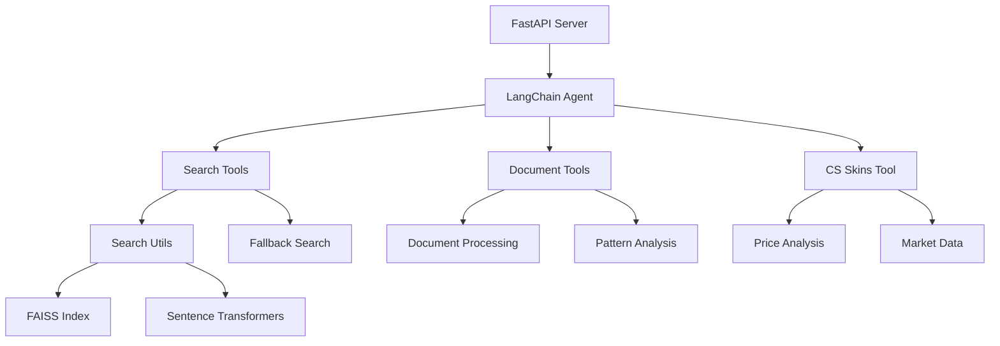

# CS2 Skin Economy Backend

A powerful backend service for CS2 (Counter-Strike 2) skin economy research and analysis, built with FastAPI and LangChain.

## Architecture Overview



## Core Components

### 1. FastAPI Server (`main.py`)
- Entry point for the application
- Handles HTTP requests and CORS
- Initializes the search engine and tools
- Manages the LangChain agent

### 2. Search Engine (`search_utils.py` & `search_utils_simplified.py`)
- Primary search implementation using FAISS and Sentence Transformers
- Fallback mechanism for when dependencies are missing
- Features:
  - Semantic search using embeddings
  - Fuzzy matching for similar items
  - Price-based filtering
  - Pattern recognition

### 3. Tools (`tools.py`)
- Collection of specialized tools for the LangChain agent:
  - `cs_skins_tool`: CS2 skin price and market data
  - `search_tool`: Web search capabilities
  - `wiki_tool`: Wikipedia information
  - `save_tool`: Data persistence
  - `document_tool`: Document analysis

### 4. Document Processing (`document_tools.py`)
- Handles document analysis and pattern recognition
- Processes structured data for the search engine
- Manages document caching and updates

## Setup Instructions

1. Clone the repository:
```bash
git clone https://github.com/yourusername/2m-backend.git
cd 2m-backend
```

2. Create and activate a virtual environment:
```bash
python -m venv venv
source venv/bin/activate  # On Windows: venv\Scripts\activate
```

3. Install dependencies:
```bash
pip install -r requirements.txt
```

4. Set up environment variables:
```bash
cp .env.example .env
# Edit .env with your configuration
```

5. Start the server:
```bash
python main.py
```

## API Endpoints

### POST /query
Main endpoint for processing queries about CS2 skins and market data.

Request:
```json
{
    "query": "What's the cheapest AK-47 skin?"
}
```

Response:
```json
{
    "answer": "Detailed response about AK-47 skins...",
    "sources": ["source1", "source2"]
}
```

### GET /
Health check endpoint.

## Search Capabilities

The backend supports various types of queries:

1. Price-based queries:
   - "cheapest AK-47"
   - "AWP skins under $50"
   - "Glock-18 between $10 and $30"

2. Pattern-based queries:
   - "Doppler patterns"
   - "Fade patterns"

3. Market analysis:
   - "price trends"
   - "market statistics"

## Development Guidelines

### Adding New Tools
1. Create a new tool function in `tools.py`
2. Register it in the `tools` list in `main.py`
3. Update the agent's prompt if necessary

### Modifying Search Behavior
1. Edit `search_utils.py` for core search functionality
2. Update `search_utils_simplified.py` for fallback behavior
3. Test both implementations

### Error Handling
- The system includes fallback mechanisms for missing dependencies
- Errors are logged and handled gracefully
- User-friendly error messages are returned

## Contributing

1. Fork the repository
2. Create a feature branch
3. Commit your changes
4. Push to the branch
5. Create a Pull Request

## License

MIT License - see LICENSE file for details
